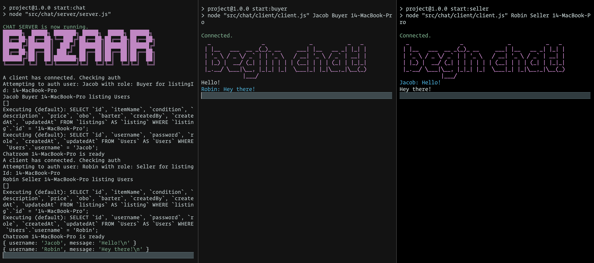
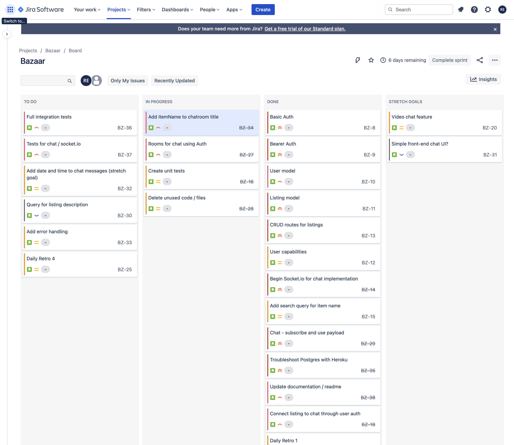

# Team JARR | Midterm Project | JavaScript 401d44

- Bazaar is a marketplace application where buyers and sellers can safely communicate in a secure space to enable successful transactions.
- It provides the ability to safely screen users before meeting in person through authentication and verified chat.

## Team Members

- Joe Ivans
- Alex Grazda
- Roop Hayer
- Ryan Emmans

[Requirements](./project-management/requirements.md)  
[Team Agreement](./project-management/team-agreement.md)

## Chat Feature



## Installation

```bash
npm install

# run main server
   npm start

# run chat server
   npm start:chat

# run chat clients
   npm start:buyer
   npm start:seller
```

## Deployment

- [Heroku](https://bazaar-jarr.herokuapp.com/)

## Dependencies

|               	|             |                 	|
|---------------	|-----------	|------------------	|
| base-64       	| bcrypt    	| chalk            	|
| dontenv       	| express   	| figlet           	|
| jsonwebtoken  	| pg        	| sequelize        	|
| sequelize-cli 	| socket.io 	| socket.io-client 	|
| sqlite3       	|           	|                  	|

### Dev Dependencies

- jest
- supertest

## Additional Tools and Technologies

|         	|           	|              	|
|---------	|-----------	|--------------	|
| Node.js 	| PostreSQL 	| Heroku       	|
| Postman 	| Npm       	| Figma FigJam 	|
| Jira    	| Discord   	| Slack        	|

## UML


## Project Management



## Resources

- [Sequelize Docs](https://sequelize.org/master/)
- [Socket.io Docs](https://socket.io/docs/v4/)
- [Medium](https://medium.com/)
