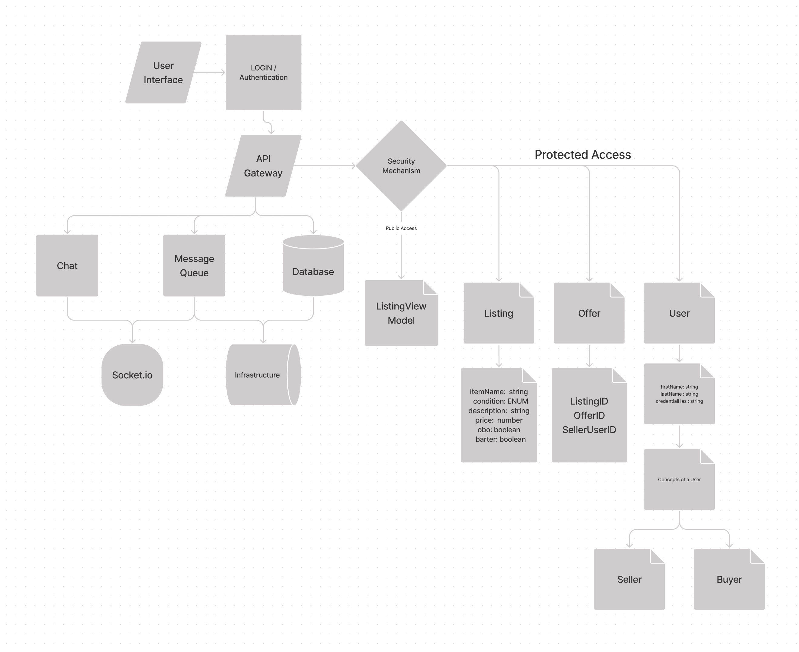

# Project - Team JARR

## Team Members

- Joe Ivans
- Alex Grazda
- Roop Hayer
- Ryan Emmans

[Requirements](./project-management/requirements.md)  
[Team Agreement](./project-management/team-agreement.md)

## Installation

```bash
npm install

# run main server
   npm start

# run chat server
   npm start:chat

# run chat clients
   npm start:buyer
   npm start:seller
```

## Deployment

- [Heroku](https://bazaar-jarr.herokuapp.com/)

## Dependencies

- base-64
- bcrypt
- chalk
- dotenv
- express
- figlet
- jsonwebtoken
- pg
- sequelize
- sequelize-cli
- socket.io
- socket.io-client
- sqlite3

### Dev Dependencies

- jest
- supertest

## UML



## Resources

- (Links will go here)
